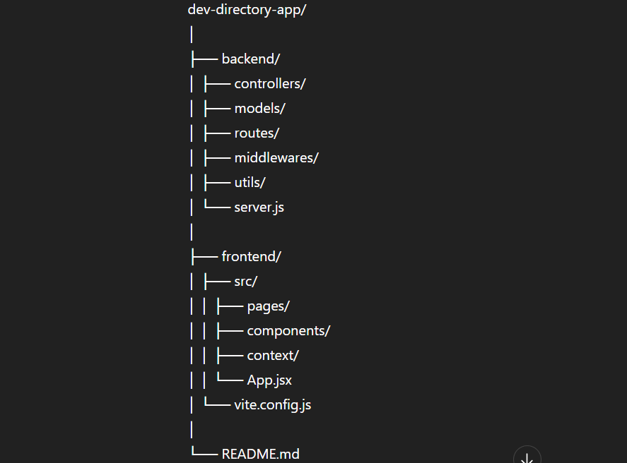
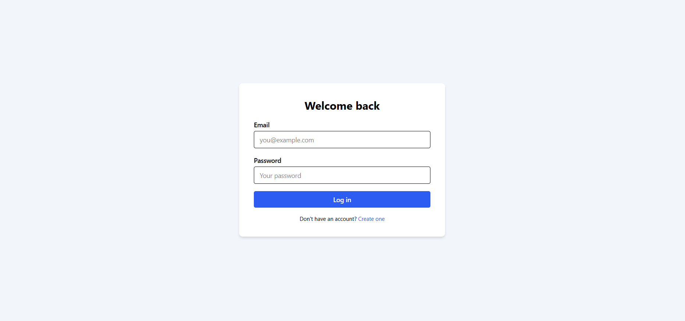
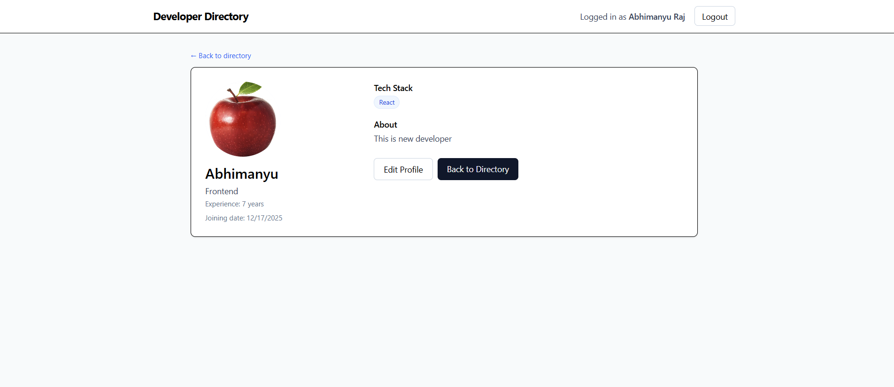

# 🚀 Developer Directory App

A full-stack MERN platform where developers can create profiles, showcase skills, and browse other developers. Includes secure authentication, profile management, and CRUD operations.

---

## 🌐 Hosted Links

| Service | Link |
|--------|------|
| Frontend | https://dev-directory-app1.vercel.app/ |
| Backend API | https://dev-directory-app-2.onrender.com |
| Complete Repo | https://github.com/abhi914200/dev-directory-app/tree/branch_2 |

---

## 📌 Tech Stack

### **Frontend**
- React (Vite)
- Axios
- React Router DOM
- Tailwind CSS

### **Backend**
- Node.js
- Express.js
- MongoDB + Mongoose
- JWT Authentication
- Zod Validation

### **Deployment**
- Frontend: Vercel
- Backend: Render
- Database: MongoDB Atlas

---

## ✨ Features

| Feature | Description |
|--------|-------------|
| 🔐 JWT Authentication | Signup, Login, Protected Routes |
| 🧾 Profile CRUD | Create, update & delete developer profile |
| 🧰 Skills Showcase | Add tech skills, bio, social links |
| 👥 Developer Listing | Explore all registered developers |
| 🛡️ Validation | Zod-based server validation |
| 🔗 Token Storage | Persistent login using localStorage |
| 🗂️ REST APIs | Fully structured backend routes |

---

## 📁 Project Structure

  

  

  

  

🚀 Setup Instructions
1️⃣ Clone the Repository
git clone https://github.com/abhi914200/dev-directory-app
cd dev-directory-app

2️⃣ Environment Variables
Backend (.env)
PORT=4000
MONGO_URI=your_mongo_db_connection
JWT_SECRET=your_secret_key
CLIENT_URL=http://localhost:5173

Frontend (.env)
VITE_API_BASE_URL=http://localhost:4000/api

▶️ Running the App Locally
Backend
cd backend
npm install
npm run dev

Frontend
cd frontend
npm install
npm run dev

🔐 Authentication Flow

On login/signup → JWT is generated & stored in localStorage

Axios interceptor attaches token on each request:

Authorization: Bearer <token>

📡 API Endpoints
Auth Routes
Method	Endpoint	Description
POST	/api/auth/signup	Register new developer
POST	/api/auth/login	Login & get token
Developer Routes
Method	Endpoint	Description
GET	/api/developers	Get all developers
GET	/api/developers/:id	Get developer by ID
POST	/api/developers/Create profile
PUT	/api/developers/:id	Update profile
DELETE	/api/developers/:id	Delete profile
🧪 Validation

Zod validation middleware ensures clean & safe input:

validateRequest(schema)

📌 Future Enhancements

📸 Cloudinary image upload

⭐ Skill rating & endorsements

📨 Contact developer messaging

📧 Contact
- Email: [abhimanyu.12g@gmail.com](mailto:abhimanyu.12g@gmail.com)
If you have any improvements, feel free to submit a PR!

Developer: Abhimanyu Raj
Project: Developer Directory App