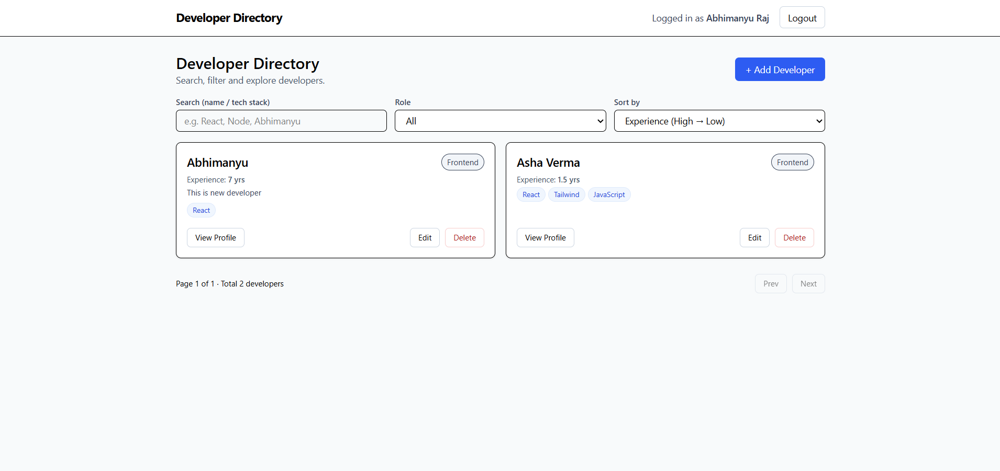

# 🚀 Developer Directory App

A full-stack MERN directory where developers create profiles, showcase skills, and browse others. Includes JWT auth, profile CRUD, validation, and a searchable listing.

---


## Table of Contents
- [Hosted Links](#hosted-links)
- [Tech Stack](#tech-stack)
- [Auth Flow – Sequence Overview](#auth-flow--sequence-overview)
- [Developer Profile CRUD – Sequence Overview](#developer-profile-crud--sequence-overview)
- [Features](#features)
- [Project Structure & Screenshots](#project-structure--screenshots)
- [Quick Start](#quick-start)
- [Environment Variables](#environment-variables)
- [API Endpoints](#api-endpoints)
- [Validation & Auth](#validation--auth)
- [Contributing](#contributing)
- [Contact](#contact)
- [License](#license)

---

## Hosted Links
- Frontend: https://dev-directory-app1.vercel.app/  
- Backend API: https://dev-directory-app-2.onrender.com  
- Repo (branch_2): https://github.com/abhi914200/dev-directory-app/tree/branch_2

---

## Tech Stack
- Frontend: React (Vite), Axios, React Router, Tailwind CSS  
- Backend: Node.js, Express, MongoDB + Mongoose, JWT, Zod (validation)  
- Deployment: Vercel (frontend), Render (backend), MongoDB Atlas (DB)

---
## 🔁 Auth Flow – Sequence Overview

```text
User                Frontend (React)           Backend (Express)          Database (MongoDB)
 ───────────────────────────────────────────────────────────────────────────────────────────
  |  Submit login/signup form  |                         
  | -------------------------> |  axios.post("/auth")    
  |                            | ----------------------> |  Validate request (Zod)
  |                            |                         |  Check user in DB
  |                            |                         | ----------> [Find/Create User]
  |                            |                         |  Generate JWT token
  |                            | <---------------------- |  { token, user }
  |        Store token in localStorage                   
  | <------------------------- |  Navigate to protected route
  |                            |  axios.get("/developers", { Authorization: Bearer <token> })
  |                            | ----------------------> |  Verify JWT (middleware)
  |                            |                         |  Fetch developers
  |                            | <---------------------- |  [developers list]
  |  View protected data       |                         


## 🧾 Developer Profile CRUD – Sequence Overview

```text
User                   Frontend (React)            Backend (Express)             Database (MongoDB)
──────────────────────────────────────────────────────────────────────────────────────────────────
  |  Open Profile Form     |                                                        
  | ----------------------> |  axios.get("/developers/:id")                          
  |                        | -----------------------------> |  Verify JWT
  |                        |                                 |  Fetch existing profile
  |                        | <----------------------------- |  { profile data }
  |  Edit & Submit Form    |                                                        
  | ----------------------> |  axios.put("/developers/:id", body, headers)           
  |                        | -----------------------------> |  Validate (Zod)
  |                        |                                 |  Update profile
  |                        |                                 | -----------> save()
  |                        | <----------------------------- |  { updated profile }
  |   UI Refresh           |                                                        
  |                        |  display success toast/banner  


## Features

- 🔐 JWT-based authentication (signup / login)
- 🧾 Full profile CRUD (create / read / update / delete)
- 🧰 Tech stack, bio, photo, joining date, experience
- 🔎 Search, filter, sort, pagination for developer listings
- ✅ Zod validation middleware to sanitize inputs
- 🔁 Persistent login using localStorage + Axios interceptor

---

## Project Structure & Screenshots

<p>
  
</p>
<p>
  
</p>


<table>
  <tr>
    <td><a href="https://dev-directory-app1.vercel.app/login"></a></td>
    <td><a href="https://dev-directory-app1.vercel.app/signup"></a></td>
  </tr>
</table>

<p>
  
</p>
<p>
  
</p>

---

## Quick Start

Clone and run locally:

```powershell
git clone https://github.com/abhi914200/dev-directory-app
cd dev-directory-app

# Backend
cd backend
npm install
npm run dev

# Frontend (new terminal)
cd ../frontend
npm install
npm run dev
```

---

## Environment Variables

Backend (.env)
```
PORT=4000
MONGO_URI=your_mongo_db_connection
JWT_SECRET=your_secret_key
CLIENT_URL=http://localhost:5173
```

Frontend (.env)
```
VITE_API_BASE_URL=http://localhost:4000/api
```

---

## API Endpoints

Auth
- POST /api/auth/signup — register
- POST /api/auth/login — login, returns JWT

Developers (protected)
- GET /api/developers — list (supports search/role/sort/page/limit)
- GET /api/developers/:id — get by id
- POST /api/developers — create profile
- PUT /api/developers/:id — update profile
- DELETE /api/developers/:id — delete profile

Notes:
- Protected endpoints require header: Authorization: Bearer <token>

---

## Validation & Auth
- Zod schemas validate body/query/params via validateRequest middleware.
- Auth middleware checks JWT and attaches user to req.user.
- If you run into "jwt malformed" ensure the client sends the header exactly:
  Authorization: Bearer <token>

---

## Contributing
Contributions welcome. Please:
1. Fork the repo
2. Create a feature branch
3. Open a PR with a clear description

---

## Contact
- Email: [abhimanyu.12g@gmail.com](mailto:abhimanyu.12g@gmail.com)

---

## License
This project is licensed under the MIT License - feel free to use it for learning and personal projects.
